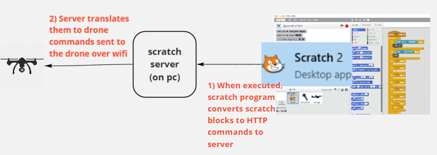
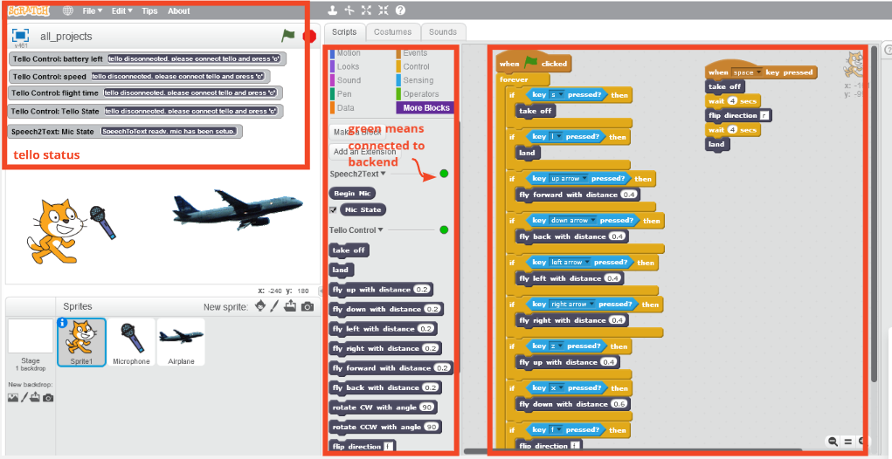
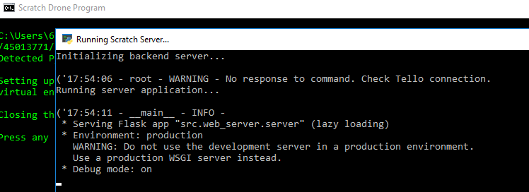
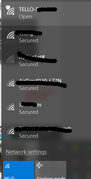
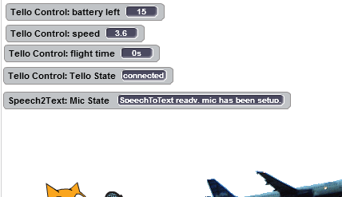

# Controlling DJI Tello Drone using Scratch
A makerfaire 2018 project

## Overview  
**Basic Architecture**  

**Prerequisitess**  
- Scratch 2.0 Offline Editor [download link](https://scratch.mit.edu/download)
- DJI Tello (i bought mine for around SGD 135)
- Python 3.6

## 1) Open Scratch 2.0 and import the project

1) Open Scratch 2.0 Program
2) Go to File -> Open
3) Go to the /projects folder in the project root folder
4) Select all_projects.sb2 to see preprogrammed templates.

**Scratch Window**  

You basically drag and drop block commands from the command palette to the execution panel
to program the drone.

Drone Blocks reside in *More Blocks* section in command palette.

## 2) Start the python backsend server
Go to project folder and double click on the **start.bat** script.
It will first install your virtual environment if you dont have one, and then start the server.

To check that the scratch program is detecting the backend server, ensure that there is a green
circle status output at the *More Blocks* command palette

## 3) To connect the drone to the wifi network  

1) Open your wifi panel and connet to the drone's Wifi SSID
2) Go back to the Scratch program and press ‘c’ on the keyboard to connect the drone
3) Ensure the tello state is connected and properties are populated at the tello status section

You are ready!! :D

## References  
- https://www.halfchrome.com/program-the-ryze-tello-with-scratch/ (this one is using nodejs as backend server)  
- https://dl-cdn.ryzerobotics.com/downloads/tello/0228/Tello+SDK+Readme.pdf  
- https://en.scratch-wiki.info/w/images/ExtensionsDoc.HTTP-9-11.pdf  
- https://gist.github.com/microlinux/82409619242be5f7210b7fea7bb4251e
